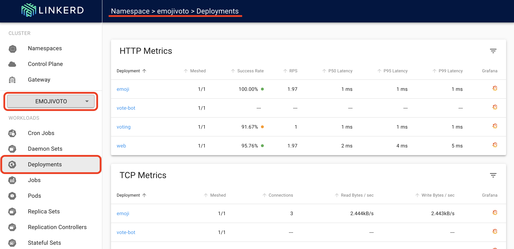
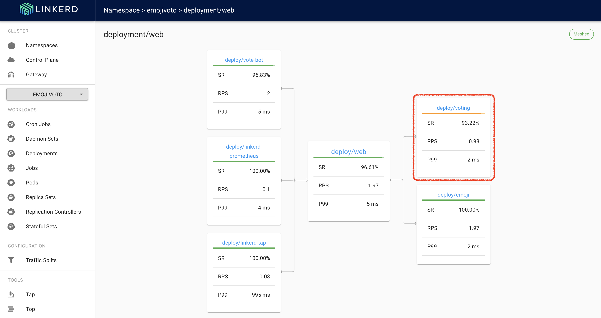
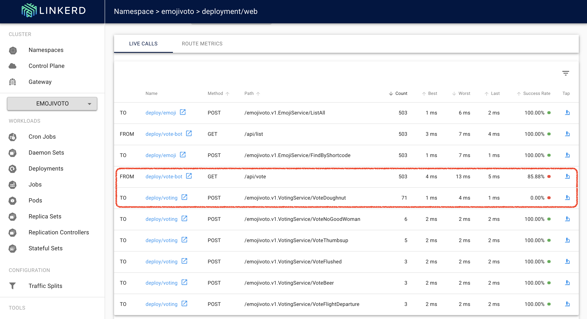
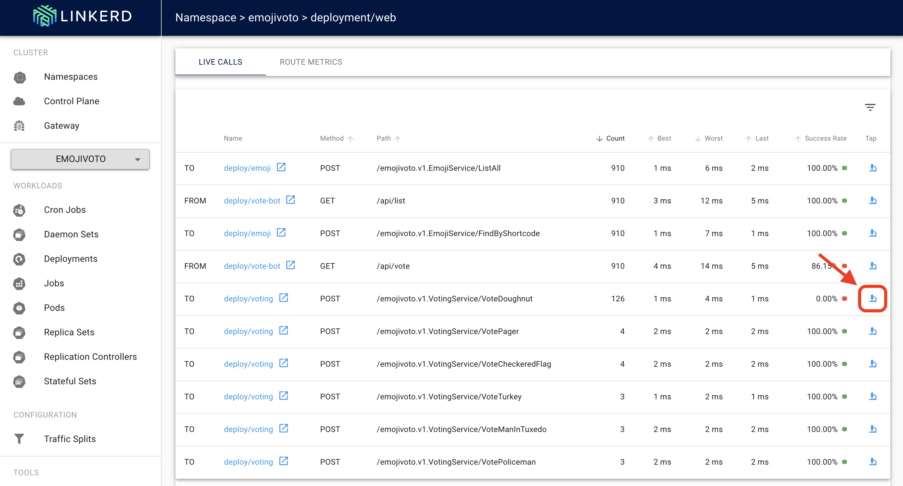
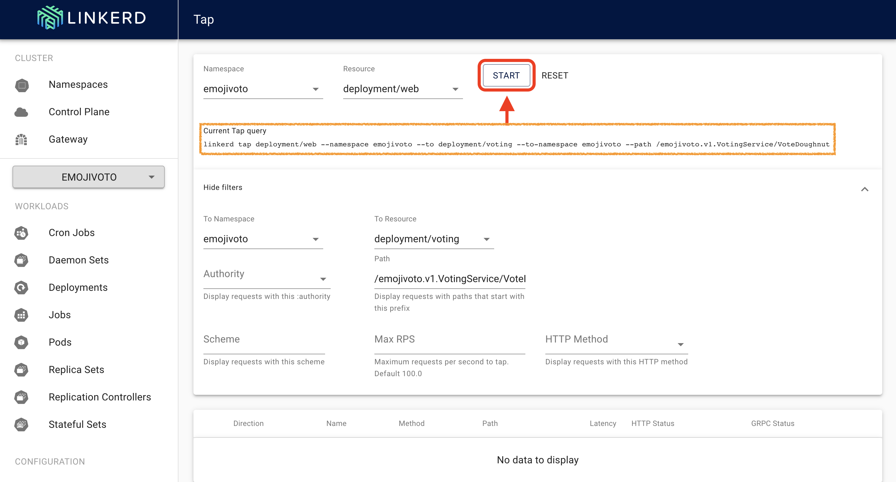
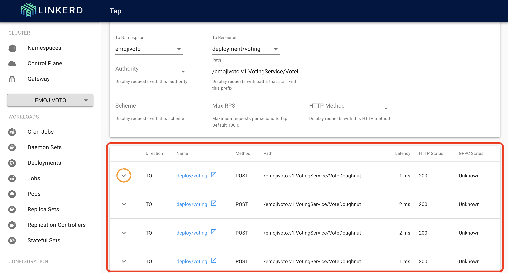

# LAB 03: Debugging with Linkerd

## Description

In this lab we will debug the issue introducedin the emojivoto application 

## Instructions

1. Retrieve the linkerd dashboard external IP and browse linkerd dashboard 

```
kubectl get svc linkerd-web -n linkerd
```
```
https://<service-external-ip>:8084
```

2. Browse to the emojivoto namespace deployments



3. The first thing you might notice is that the success rate is well below 100%! Click on web and let's dig in


4. You should now be looking at the Deployment page for the web deployment. The first thing you'll see here is that the web deployment is taking traffic from vote-bot (a deployment included with emojivoto to continually generate a low level of live traffic). The web deployment also has two outgoing dependencies, emoji and voting. 



Note: While the emoji deployment is handling every request from web successfully, it looks like the voting deployment is failing some requests! A failure in a dependent deployment may be exactly what is causing the errors that web is returning.

5. Let's scroll a little further down the page, we'll see a live list of all traffic that is incoming to and outgoing from web. Note that there are two calls that are not at 100%: the first is vote-bot's call to the /api/vote endpoint. The second is the VoteDoughnut call from the web deployment to its dependent deployment, voting.



Note: Since /api/vote is an incoming call, and VoteDoughnut is an outgoing call, this is a good clue that this endpoint is what's causing the problem!

6. To dig a little deeper, we can click on the tap icon in the far right column. This will take us to the live list of requests that match only this endpoint.



7. Click on "Start" to start the Tap session



Note: That you can see the linkerd cli command to retrieve the data under "Current Tap Query"

8. In the table below you will see the live list of requests that match only this endpoint. Note the "Unknown" under the "GRPC status" column



9. Click the arrow in the left side (marked in orange in the previous image) to see the request details


10. Finally, requests are failing with a gRPC status code 2, which is a common error response. If you look in the source code you will find the following: 

```
func (pS *PollServiceServer) VotePoop(_ context.Context, _ *pb.VoteRequest) (*pb.VoteResponse, error) {
	return nil, fmt.Errorf("ERROR")
}
```

Note: Linkerd is aware of gRPC's response classification without any other configuration!