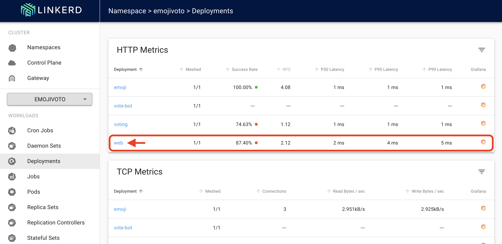
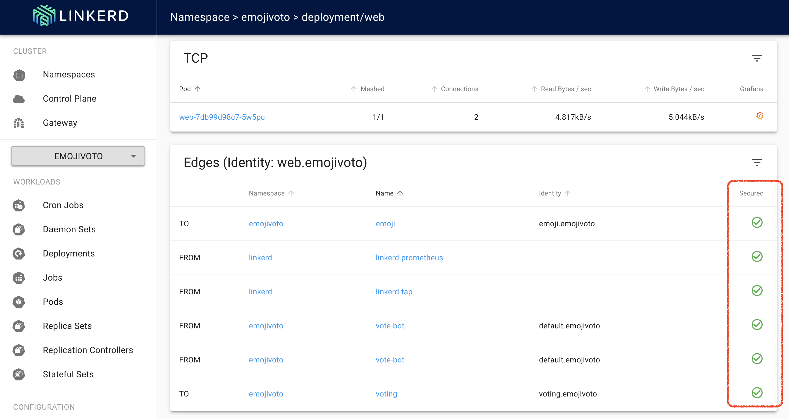

# LAB 04: Validating Linkerd mTLS

## Description

In this lab we will validate that the mTLS automatically provided by Linkerd is working 

## Instructions

1. Retrieve the linkerd dashboard external IP and browse linkerd dashboard 

```
kubectl get svc linkerd-web -n linkerd
```
```
https://<service-external-ip>:8084
```

---

2. Let's start by checking if all traffic related to the emojivoto web deployment is managed with mTLS





- Note: This can be easily checked in the edges section as shown above

---

3. You can use the command line as well to check the Linkerd edges

```
linkerd -n emojivoto edges deployment
```
```
linkerd -n emojivoto edges po
```

---

4. Let's stream the web deployment traffic in real time to understand what is getting mTLS'd by using the linkerd tap command

```
linkerd -n emojivoto tap deploy/web --as $(gcloud config get-value account)
```

- Note: check the "tls" property

---

5. Now let's do the same but to all the deployments of the control plane

```
linkerd -n linkerd tap deploy --as $(gcloud config get-value account)
```

- Note: This time you will see some requests that are not mTLS'd, for example:

```
req id=3:1 proxy=in  src=10.36.0.1:49556 dst=10.36.0.20:3000 tls=no_tls_from_remote :method=GET :authority=10.36.0.20:3000 :path=/api/health
rsp id=3:1 proxy=in  src=10.36.0.1:49556 dst=10.36.0.20:3000 tls=no_tls_from_remote :status=200 latency=595µs
end id=3:1 proxy=in  src=10.36.0.1:49556 dst=10.36.0.20:3000 tls=no_tls_from_remote duration=39µs response-length=70B
```

- Note: These are calls by the Kubernetes readiness probe. As probes are initiated from the kubelet, which is not in the mesh, there is no identity and these requests are not mTLS'd, as denoted by the tls=not_provided_by_remote message
