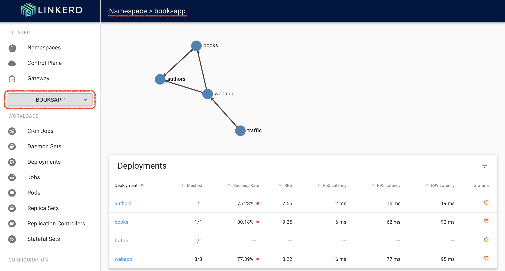
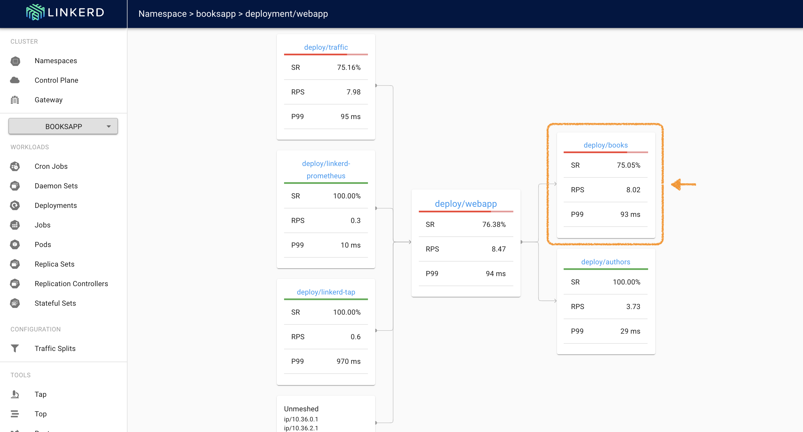
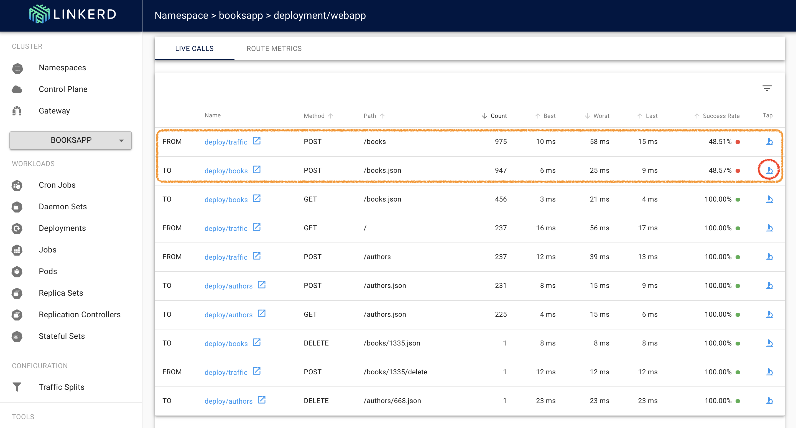
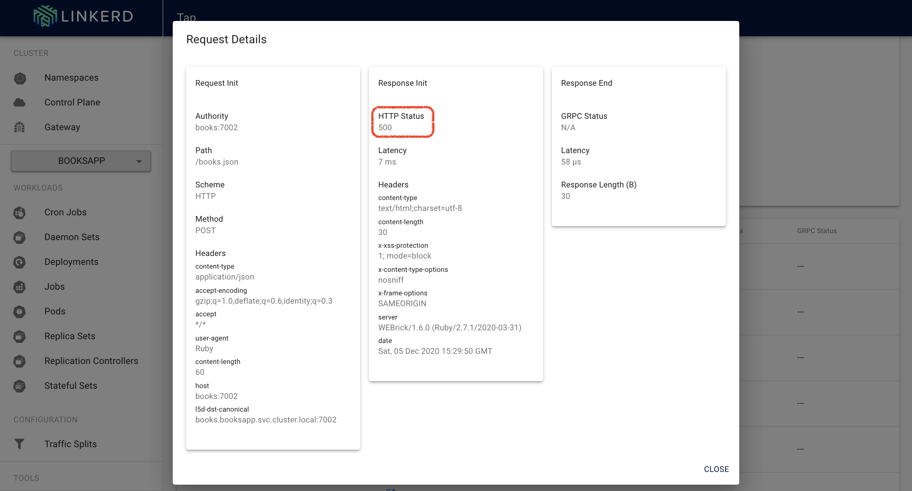

# LAB 05: Deploying and Debugging the BookApp

## Description

In this lab we will deploy the BookApp demo application and debug its network issue

## Instructions

1. Let's create a new namespace for the BookApp applicaton

```
cat << EOF | kubectl apply -f -
apiVersion: v1
kind: Namespace
metadata:
  name: booksapp
  annotations:
    linkerd.io/inject: enabled 
EOF
```

- Note: Linkerd automatically adds the data plane proxy to pods when the linkerd.io/inject: enabled annotation is present on a namespace or any workloads such as deployments or pods

---

2. Deploy the Book Application

```
kubectl -n booksapp apply -f https://raw.githubusercontent.com/leonjalfon1/sdp-servicemesh/main/resources/booksapp.yaml
```

- Note: The linkerd proxies will be automatically injected

---

3. Retrieve the external IP of the webappservice and browse it to see the application 

```
kubectl get svc webapp -n booksapp
```
```
https://<service-external-ip>:7000
```

- Note: You can try to add books (several times) to get the application issue (Internal Server Error)

--- 

4. Retrieve the linkerd dashboard external IP and browse to the booksapp namespace to see the application details

```
kubectl get svc linkerd-web -n linkerd
```
```
https://<service-external-ip>:8084
``` 

<kbd></kbd>

---

5. Let's use Linkerd to discover the root cause of this app's failures. Click on the webapp deployment for a live debugging session.

<kbd></kbd>

- Note: A failure in a dependent service may be exactly what’s causing the errors that webapp is returning. We can see that the books service is also failing.

---

6. Let’s scroll a little further down the page, we’ll see a live list of all traffic endpoints that webapp is receiving.

<kbd></kbd>

- Notes: We can see that inbound traffic coming from the webapp service going to the books service is failing a significant percentage of the time. That could explain why webapp was throwing intermittent failures.

---

7. Let’s click on the tap (🔬) icon and then on the Start button to look at the actual request and response stream. 

<kbd></kbd>

- Note: Indeed, many of these requests are returning 500’s. It was surprisingly easy to diagnose an intermittent issue that affected only a single route. You now have everything you need to open a detailed bug report explaining exactly what the root cause is.