# LAB 08: Exploring Istio

## Description

In this lab we will deploy the book info application and we will explore the observability tools (addons)

## Instructions

1. Before we deploy the application, let's add a namespace label to instruct Istio to automatically inject Envoy sidecar proxies in the default namespace

```
kubectl label namespace default istio-injection=enabled
```

- Note: You can also manually inject the istio proxy using something like: "kubectl apply -f <(istioctl kube-inject -f ~/mypath/mymanifest.yaml)"

---

2. Deploy the Bookinfo sample application

```
kubectl apply -f $HOME/istio-1.8.0/samples/bookinfo/platform/kube/bookinfo.yaml
```

---

3. Let's inspect the deployed resources

```
kubectl -n default get all
```

```
kubectl -n default get pods --watch
```

- Note: Wait until all pods report READY 2/2 and STATUS Running before you go to the next step

---

4. Let's expose the application to outside traffic by creating a istio Gateway and a VirtualService

```
kubectl apply -f $HOME/istio-1.8.0/samples/bookinfo/networking/bookinfo-gateway.yaml
```

- Note: To see the manifests you can run "cat $HOME/istio-1.8.0/samples/bookinfo/networking/bookinfo-gateway.yaml"

---

5. Ensure that there are no issues with the configuration

```
istioctl analyze
```

- Note: istioctl analyze is a diagnostic tool that can detect potential issues with your Istio configuration. It can run against a live cluster or a set of local configuration files. It can also run against a combination of the two, allowing you to catch problems before you apply changes to a cluster.

---

6. Get the external IP of the ingress gateway so we can browse to the application

```
kubectl get service istio-ingressgateway -n istio-system
```

---

7. Browse to the product page

```
http://<ingress-gateway-external-ip>/productpage
```

- Note: Click reload multiple times to see how the layout and content of the reviews changes as differnt versions (v1, v2, v3) of the app are called
   - Version 1: doesn’t call the ratings service
   - Version 2: calls the ratings service, and displays each rating as 1 to 5 black stars
   - Version 3: calls the ratings service, and displays each rating as 1 to 5 red stars

---

8. We can access the kiali dashboard using istioctl

```
istioctl dashboard kiali
```

- Note: Since we are working through the workstation we cannot directly access the dashboard

---

9. However due we exposed the kiali service let's retrieve it external IP

```
kubectl get svc kiali -n istio-system
```

---

10. Browse to the kiali dashboard

```
http://<kiali-external-ip>:20001/kiali
```

<kbd></kbd>

- Note: it's accessible from HTTP only (no HTTPS)

- Note: Feel free to explore by your own before you go to the next step

---

11. Browse to the "Graph" section and select the "default" namespace to visualize the application

<kbd>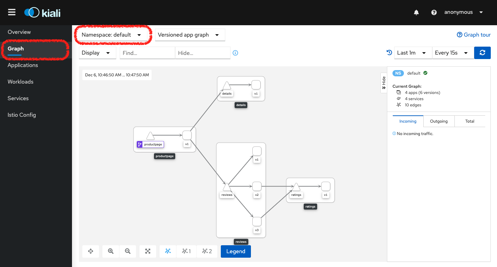</kbd>

- Note: Keep it open in your browser during the next labs to track the changes in the dashboard

---

12. Let's generate some traffic by run the following command in a new terminal (keep it open and working during the next labs)

```
while true; do curl -s -o /dev/null "http://<ingress-gateway-external-ip>/productpage"; done
```

- Note: To retrieve the "ingress-gateway-external-ip" you can use "kubectl get service istio-ingressgateway -n istio-system"

---

13. In the dashboard you will see how the traffic is routed 

<kbd>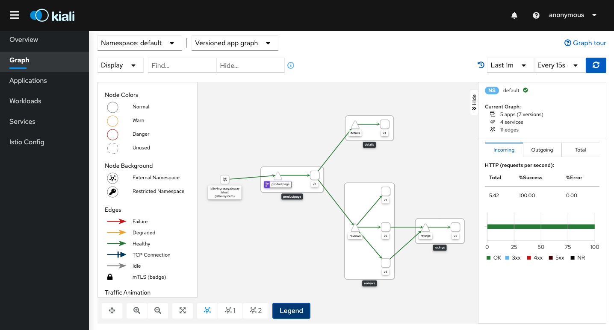</kbd>

- Note: Click on the "Legend" button to see the left side menu

---

14. Retrieve the prometheus service external IP and access it in a new tab (keep the kiali dashboard open)

```
kubectl get svc prometheus -n istio-system
```

```
http://<prometheus-external-ip>:9090
```

<kbd></kbd>

- Note: If we were not working through the workstation you could access directly using the command "istioctl dashboard prometheus"

---

15. Let's run a prometheus query by adding the expression below and click the "Execute" button

```
sum(rate(istio_requests_total{reporter="source",source_workload="productpage-v1",destination_service_name="reviews"}[1m])) by (source_workload,source_version,destination_service_name,destination_workload,destination_version,request_protocol,response_code)
```

<kbd>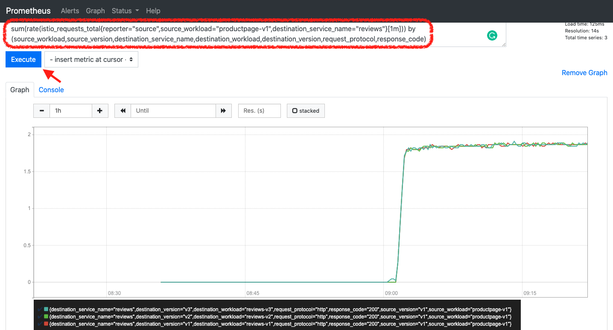</kbd>

- Note: istio_requests_total is a COUNTER that aggregates request totals between Kubernetes workloads, and groups them by response codes, response flags and security policy. This can be useful to compute the request rate (RPS) between different workloads. The query above computes the requests per second in the last hour between the productpage and the reviews services, and groups the results by response code and workload subsets

- Note: Click on the "Graph" tab to see the results in a graph

---

16. Finally let's see what is being monitored by click on Status/Targets or by browsing directly to

```
http://<prometheus-external-ip>:9090/targets
```

<kbd>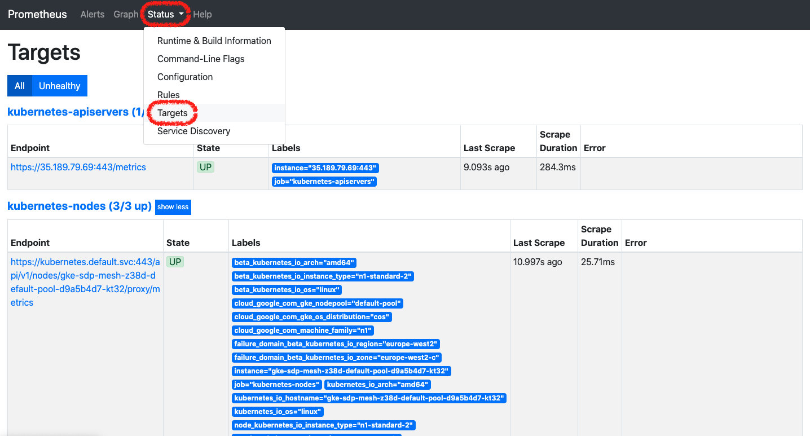</kbd>

- Note: As you can realize istio monitor your cluster automatically

---

17. Now it is grafana's turn, let's return its external ip and access it. Then click on the "Home" icon to see the available dashboards under the istio directory

```
kubectl get svc grafana -n istio-system
```

```
http://<grafana-external-ip>:3000
```

<kbd>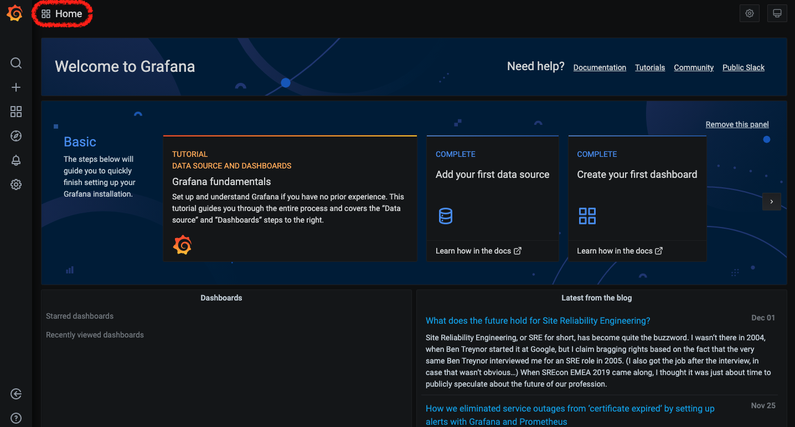</kbd>

<kbd>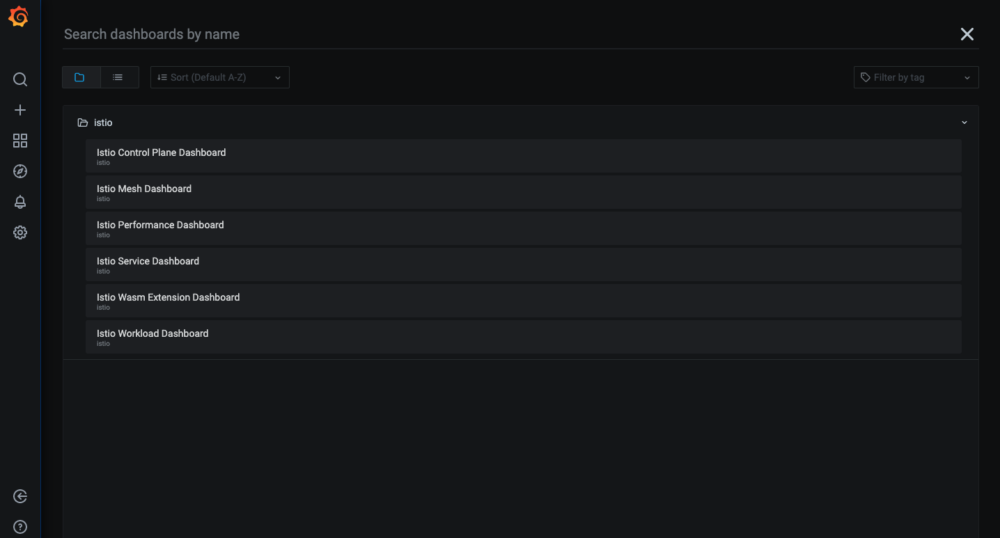</kbd>

- Note: If we were not working through the workstation you could access directly using the command "istioctl dashboard grafana"

- Note: Feel free to explore by your own before you go to the next step

---

18. Let's explore the Istio Mesh Dashboard to get a general overview about or mesh

<kbd>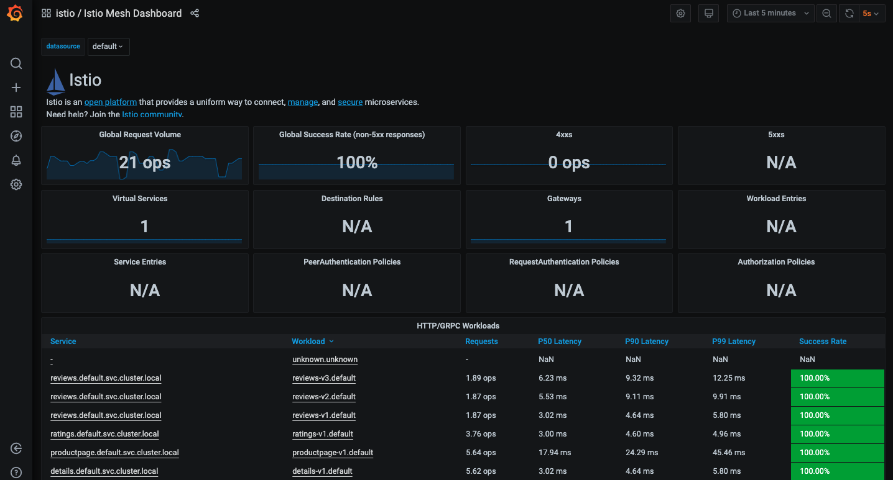</kbd>

- Note: This dashboard gives the global view of the Mesh along with services and workloads in the mesh. You can get more details about services and workloads by navigating to their specific dashboards as explained below.

---

19. Is time to accesss the Istio Service Dashboard

- Note: This dashboard gives details about metrics for the service and then client workloads (workloads that are calling this service) and service workloads (workloads that are providing this service) for that service

<kbd>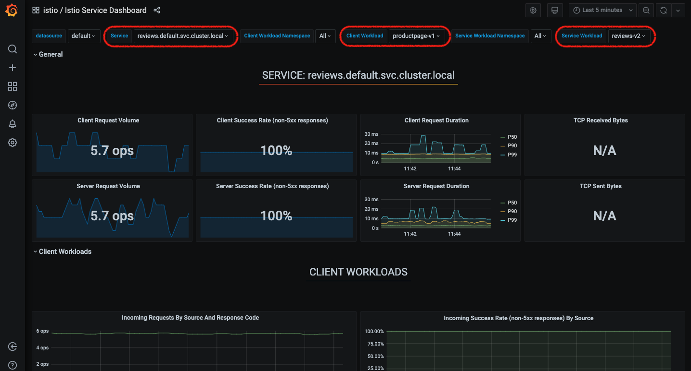</kbd>

- Note: An interesting example is the "reviews" service in which you can filter the metrics that provide from the "productpage-v1" and use the "ratings-v2" service

---

20. What about tracing? Let's access to jaeger dashboard by return its external ip and access it.

```
kubectl get svc tracing -n istio-system
```

```
http://<tracing-external-ip>:80
```

<kbd>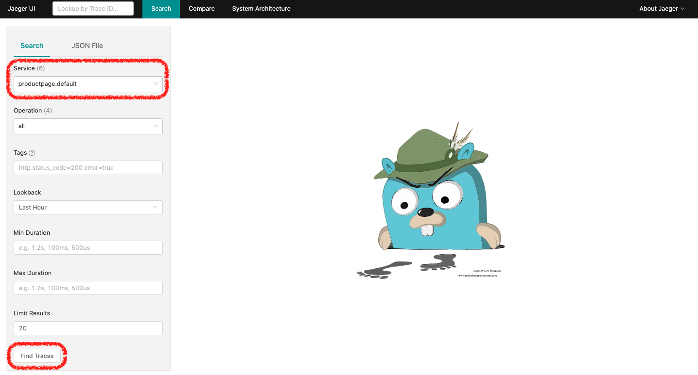</kbd>

- Note: If we were not working through the workstation you could access directly using the command "istioctl dashboard jaeger"

- Note: Feel free to explore by your own before you go to the next step

---

21. From the left-hand pane of the dashboard, select productpage.default from the Service drop-down list and click Find Traces

<kbd>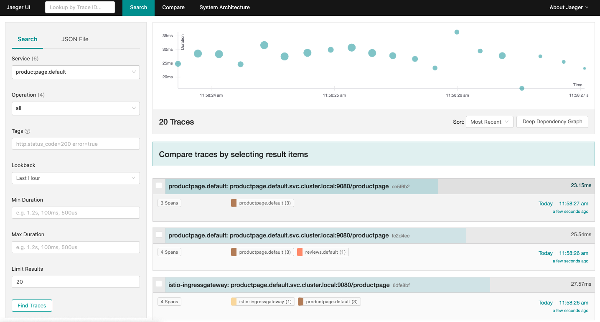</kbd>

- Note: you can add additional filters

---

22. Click on any trace to see the details corresponding to the request to the /productpage:

<kbd>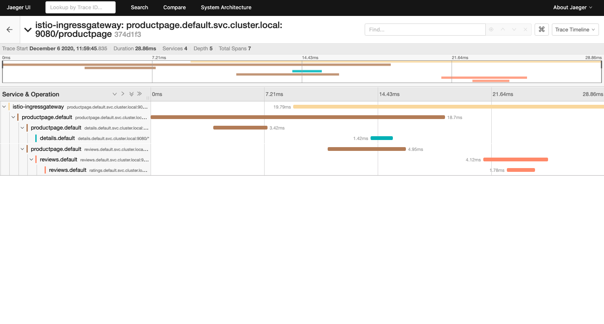</kbd>

- Note: The trace is comprised of a set of spans, where each span corresponds to a Bookinfo service, invoked during the execution of a /productpage request, or internal Istio component, for example: istio-ingressgateway.

- Note: If you wish it's possible to use Zipkin instead of Jaeger

- Note: You can configure Istio to collect trace spans and send them to Lightstep