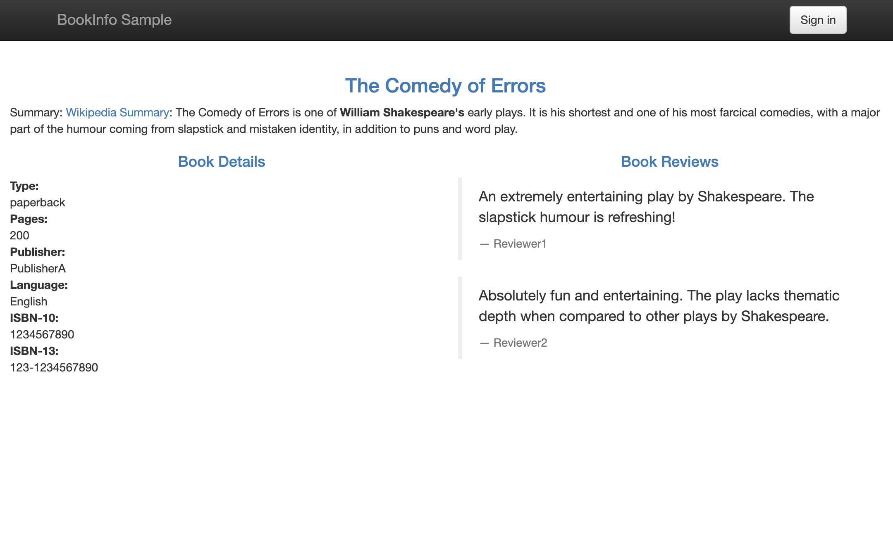
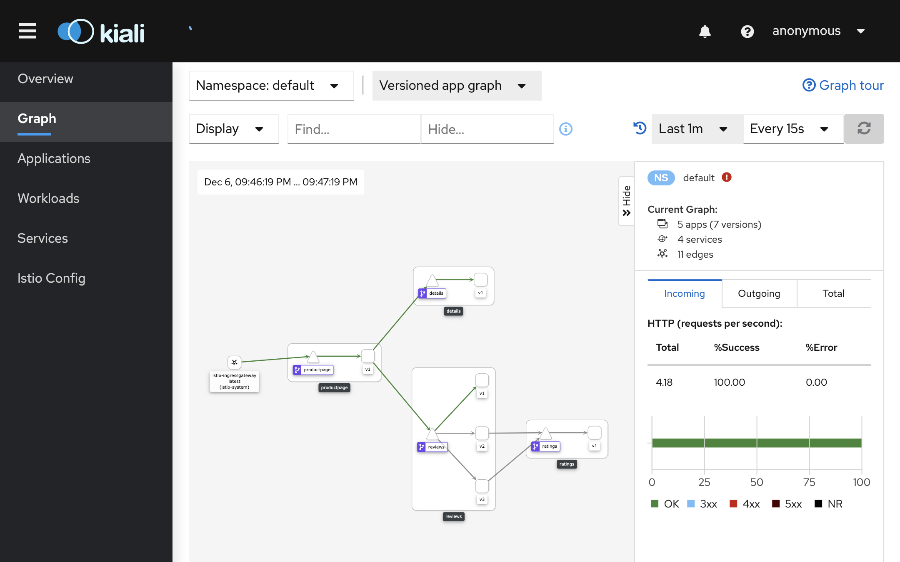
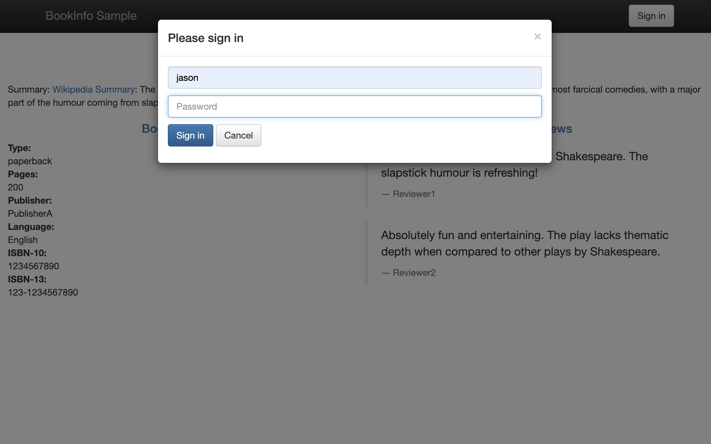
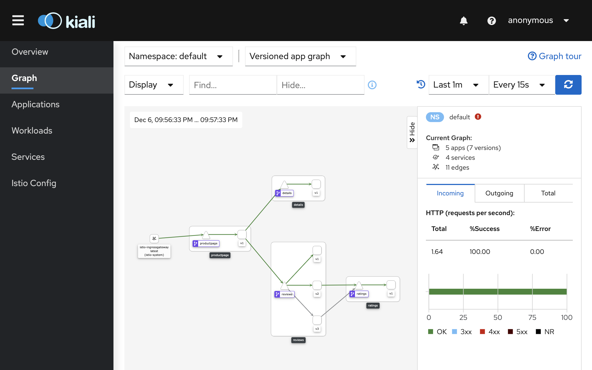

# LAB 09: Intelligent Routing with Istio

## Description

In this lab we will route all the traffic to the reviews service only to version 1 (currently it reach randomally v1, v2 or v3). Then we will update the route configuration so that all traffic from the user "jason" will be routed to the service reviews:v2

## Instructions

1. Let's reload the page multiple times, you will see that each time you will get a different version of the reviews service (v1, v2, v3)

```
http://<ingress-gateway-external-ip>/productpage
```

- Note: to get the gateway-external-ip you can use the following command 

```
kubectl get service istio-ingressgateway -n istio-system
```

--

2. Let's see what happen in the dashboard, access it from the following url

```
http://<kiali-external-ip>:20001/kiali
```

<kbd></kbd>

- Note: to retrieve the kiali-external-ip you can use the following command 

```
kubectl get svc kiali -n istio-system
```

- Note: Browse to the "Graph" section and select the "default" namespace to visualize the application

---

3. Before we can use Istio to control the Bookinfo version routing, we’ll need to define the available versions, called subsets, in the destination rules. Let's inspect the destination rules resource that we will apply

```
cat $HOME/istio-1.8.0/samples/bookinfo/networking/destination-rule-all.yaml
```

---

4. Deploy the destination rules resource

```
kubectl apply -f $HOME/istio-1.8.0/samples/bookinfo/networking/destination-rule-all.yaml
```

---

5. Now we are ready to configure the virtual services to route to "v1" only. Let's inspect the resources that we'll apply

```
cat $HOME/istio-1.8.0/samples/bookinfo/networking/virtual-service-all-v1.yaml
```

- Note: All services are routed to the version 1

---

6. Apply the VirtualService resource

```
kubectl apply -f $HOME/istio-1.8.0/samples/bookinfo/networking/virtual-service-all-v1.yaml
```

---

7. Now reload the page multiple times, you will see that only version 1 of reviews is displayed each time

```
http://<ingress-gateway-external-ip>/productpage
```

<kbd></kbd>

--

8. Let's see what happen in the dashboard, access it from the following url

```
http://<kiali-external-ip>:20001/kiali
```

<kbd></kbd>

---

9. Let's change the route configuration so that all traffic from the user "jason" will be routed to the service reviews:v2. For this, we will use the following virtual service configuration

```
cat $HOME/istio-1.8.0/samples/bookinfo/networking/virtual-service-reviews-test-v2.yaml
```

--- 

8. Apply the VirtualService resource

```
kubectl apply -f $HOME/istio-1.8.0/samples/bookinfo/networking/virtual-service-reviews-test-v2.yaml
```

---

9. To test it, click Sign in from the top right corner of the page, and login using jason as user name with a blank password. You will only see reviews:v2 all the time. Others will see reviews:v1

<kbd></kbd>

---

10. Let's see what happen in the dashboard, access it from the following url

```
http://<kiali-external-ip>:20001/kiali
```

<kbd></kbd>
