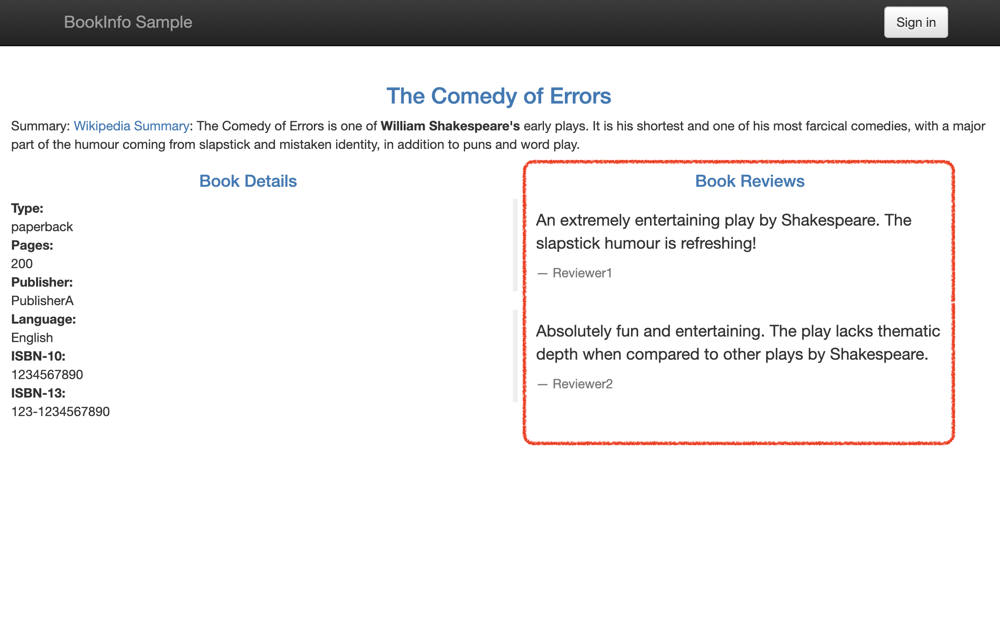
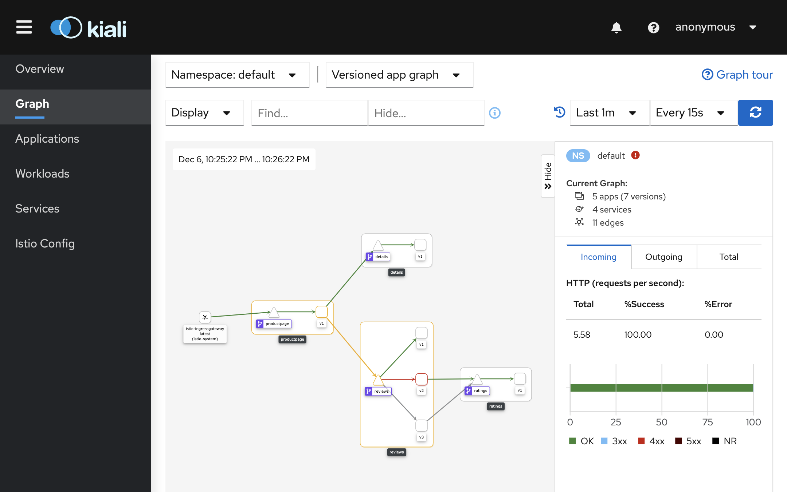
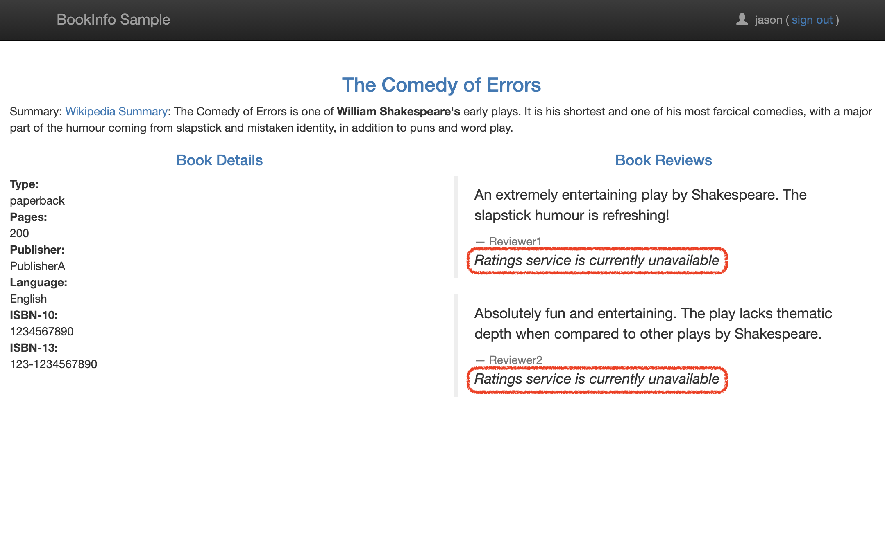
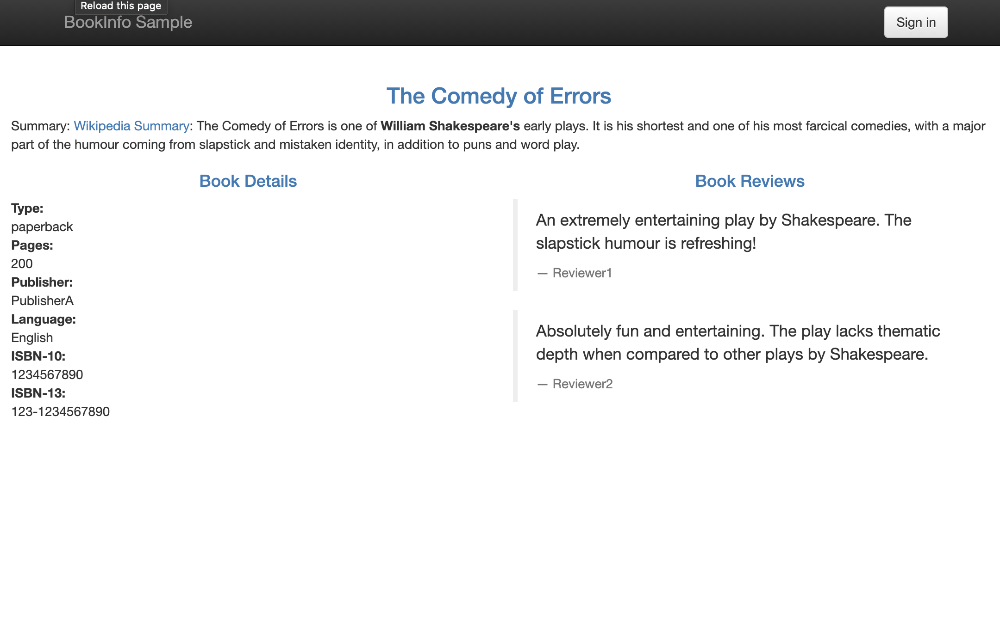
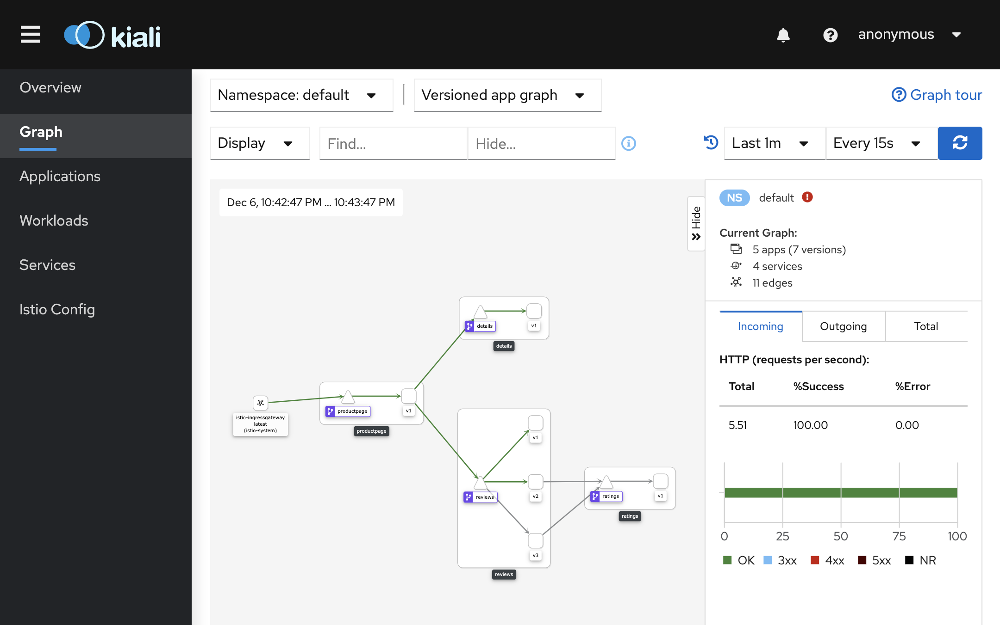
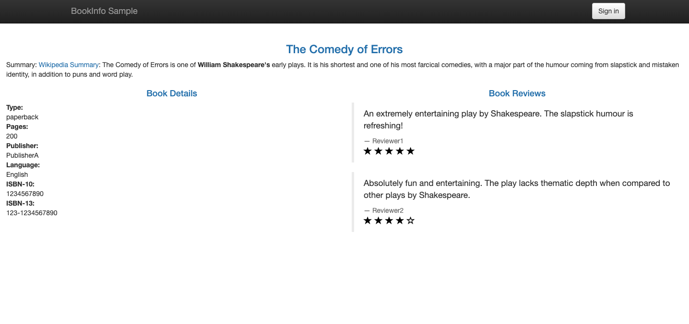
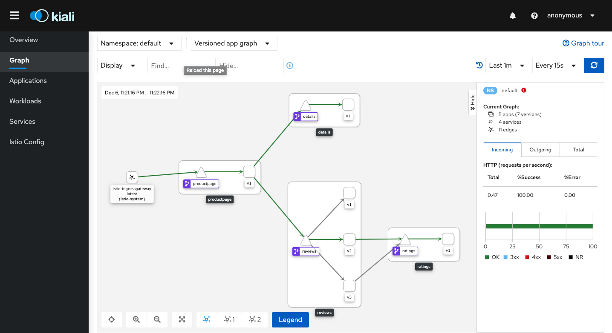
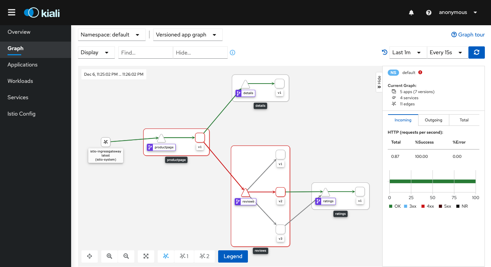

# LAB 10: Fault Injection with Istio

## Description

In this lab we will see you how to inject faults to test the resiliency of the application.

## Instructions

1. Let's inject a 7s delay between the reviews:v2 and ratings microservices for user jason (this test will uncover a bug that was intentionally introduced into the Bookinfo app). To do that we will use the following VirtualService

```
cat $HOME/istio-1.8.0/samples/bookinfo/networking/virtual-service-ratings-test-delay.yaml
```

---

2. Apply the VirtualService resource

```
kubectl apply -f $HOME/istio-1.8.0/samples/bookinfo/networking/virtual-service-ratings-test-delay.yaml
```

---

3. Sign in from the top right corner of the page, using jason as the user name with a blank password. You will see the delays and it ends up display error for reviews.

```
http://<ingress-gateway-external-ip>/productpage
```

- Note: to get the gateway-external-ip you can use the following command "kubectl get service istio-ingressgateway -n istio-system"

<kbd></kbd>

---

4. Logout and reload the page. You will see reviews without error (the delay was introduced only for user jason)

<kbd></kbd>

---

5. Let's see what happen in the dashboard, access it from the following url

```
http://<kiali-external-ip>:20001/kiali
```

<kbd></kbd>

- Note: to retrieve the kiali-external-ip you can use the following command "kubectl get svc kiali -n istio-system"

---

6. For another way to test resiliency, let's introduce an HTTP abort to the ratings microservices only for the user jason using the following VirtualService

```
cat $HOME/istio-1.8.0/samples/bookinfo/networking/virtual-service-ratings-test-abort.yaml
```

---

7. Apply the VirtualService

```
kubectl apply -f $HOME/istio-1.8.0/samples/bookinfo/networking/virtual-service-ratings-test-abort.yaml
```

---

8. Sign in from the top right corner of the page, using jason as the user name with a blank password. You will see the error message.

```
http://<ingress-gateway-external-ip>/productpage
```

<kbd></kbd>

---

9. Logout and reload the page. You will see reviews without error (the delay was introduced only for user jason)

<kbd></kbd>

---

10. Let's see what happen in the dashboard, access it from the following url

```
http://<kiali-external-ip>:20001/kiali
```

<kbd></kbd>

---

11. Before continuing, we need to route requests to v2 of the reviews service, (a version that calls the ratings service), let's do that by running the following command

```
kubectl apply -f - <<EOF
apiVersion: networking.istio.io/v1alpha3
kind: VirtualService
metadata:
  name: reviews
spec:
  hosts:
    - reviews
  http:
  - route:
    - destination:
        host: reviews
        subset: v2
EOF
```

---

11. Then, let's introduce a delay of 2 seconds to calls to the ratings service by applying the following VirtualService

```
kubectl apply -f - <<EOF
apiVersion: networking.istio.io/v1alpha3
kind: VirtualService
metadata:
  name: ratings
spec:
  hosts:
  - ratings
  http:
  - fault:
      delay:
        percent: 100
        fixedDelay: 2s
    route:
    - destination:
        host: ratings
        subset: v1
EOF
```

---

12. Browse to the BookInfo app (ensure that you are NOT logged in). You should see the Bookinfo application working normally (with ratings stars displayed), but there is a 2 second delay whenever you refresh the page.

```
http://<ingress-gateway-external-ip>/productpage
```

<kbd></kbd>

---

13. Let's see what happen in the dashboard, access it from the following url

```
http://<kiali-external-ip>:20001/kiali
```

<kbd></kbd>

---

14. Now add a half second request timeout for calls to the reviews service

```
kubectl apply -f - <<EOF
apiVersion: networking.istio.io/v1alpha3
kind: VirtualService
metadata:
  name: reviews
spec:
  hosts:
  - reviews
  http:
  - route:
    - destination:
        host: reviews
        subset: v2
    timeout: 0.5s
EOF
```

---

15. Refresh the Bookinfo web page. You should now see that it returns in about 1 second, instead of 2, and the reviews are unavailable.

```
http://<ingress-gateway-external-ip>/productpage
```

<kbd></kbd>

---

16. Let's see what happen in the dashboard, access it from the following url

```
http://<kiali-external-ip>:20001/kiali
```

<kbd></kbd>

---

In this task, you used Istio to set the request timeout for calls to the reviews microservice to half a second. By default the request timeout is disabled. Since the reviews service subsequently calls the ratings service when handling requests, you used Istio to inject a 2 second delay in calls to ratings to cause the reviews service to take longer than half a second to complete and consequently you could see the timeout in action.

You observed that instead of displaying reviews, the Bookinfo product page (which calls the reviews service to populate the page) displayed the message: Sorry, product reviews are currently unavailable for this book. This was the result of it receiving the timeout error from the reviews service.
