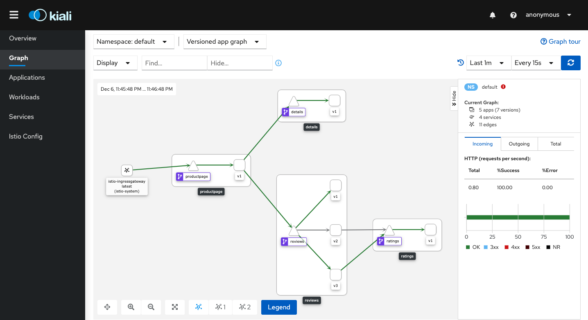
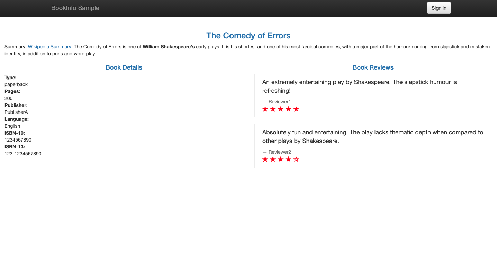
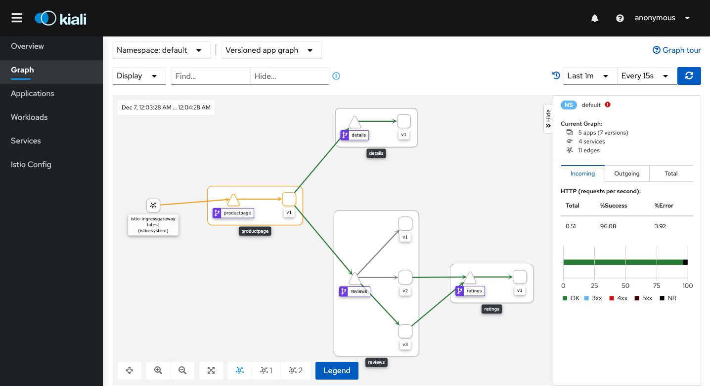

# LAB 10: Traffic Management with Istio

## Description

In this lab we will gradually migrate traffic from version 1 to version 3 for the reviews service

## Instructions

1. Let's send 50% of traffic to reviews:v1 and 50% to reviews:v3 using the following VirtualService

```
cat $HOME/istio-1.8.0/samples/bookinfo/networking/virtual-service-reviews-50-v3.yaml
```

---

2. Apply the manifest

```
kubectl apply -f $HOME/istio-1.8.0/samples/bookinfo/networking/virtual-service-reviews-50-v3.yaml
```

---

3. To test it, refresh your browser over and over, you’ll see only reviews:v1 and reviews:v3

```
http://<ingress-gateway-external-ip>/productpage
```

- Note: to get the gateway-external-ip you can use the following command "kubectl get service istio-ingressgateway -n istio-system"

---

4. Let's see what happen in the dashboard, access it from the following url

```
http://<kiali-external-ip>:20001/kiali
```



- Note: to retrieve the kiali-external-ip you can use the following command "kubectl get svc kiali -n istio-system"

---

5. Assuming you decide that the reviews:v3 microservice is stable, you can route 100% of the traffic to it usign the following configuration

```
cat $HOME/istio-1.8.0/samples/bookinfo/networking/virtual-service-reviews-v3.yaml
```

---

6. Apply the changes

```
kubectl apply -f $HOME/istio-1.8.0/samples/bookinfo/networking/virtual-service-reviews-v3.yaml
```

---

7. To test it, refresh your browser over and over, you’ll see only reviews:v3

```
http://<ingress-gateway-external-ip>/productpage
```



---

8. Let's see what happen in the dashboard, access it from the following url

```
http://<kiali-external-ip>:20001/kiali
```


---

9. Finally, let's mirror the 50% of the traffic from reviews:v3 to reviews:v2

```
kubectl apply -f - <<EOF
apiVersion: networking.istio.io/v1alpha3
kind: VirtualService
metadata:
  name: reviews
spec:
  hosts:
    - reviews
  http:
  - route:
    - destination:
        host: reviews
        subset: v3
      weight: 100
    mirror:
      host: reviews
      subset: v2
    mirror_percent: 50
EOF
```

---

7. Refresh your browser several times to ensure that you get reviews:v3 only

```
http://<ingress-gateway-external-ip>/productpage
```


---

8. Let's see what happen in the dashboard, access it from the following url

```
http://<kiali-external-ip>:20001/kiali
```



- Note: reviews:v2 generate load to ratings:v1 although nobody sends requests to him