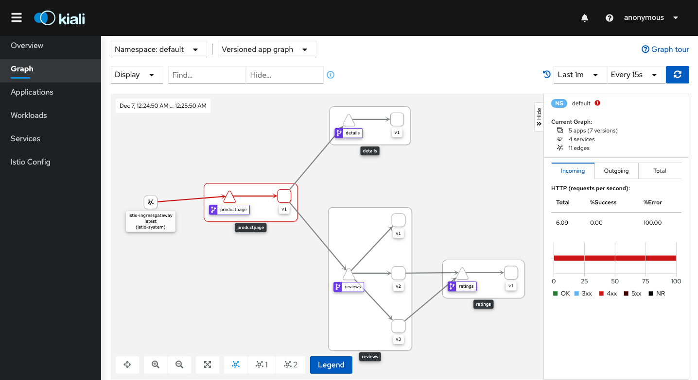
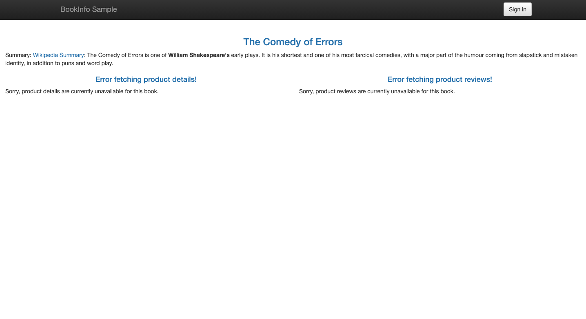
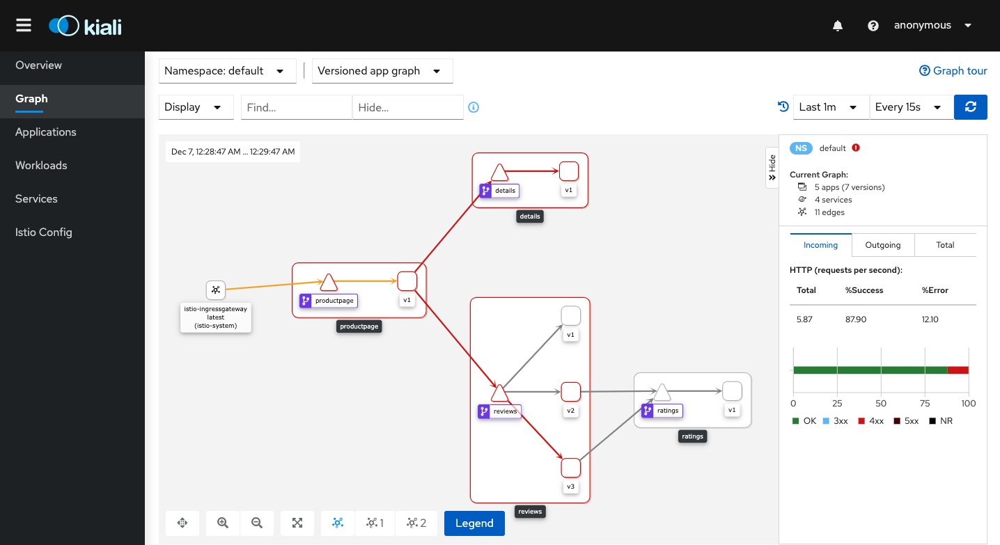
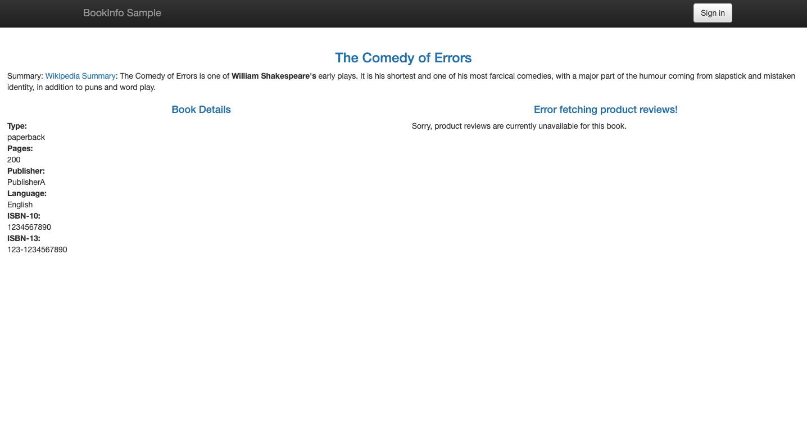
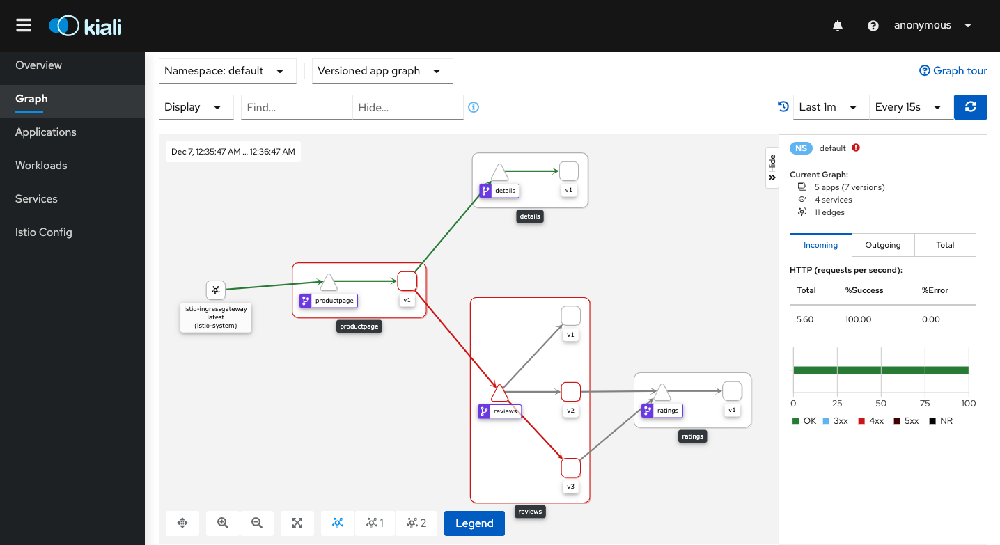
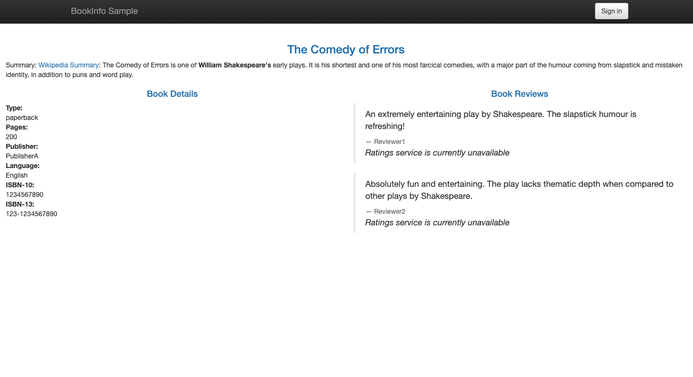
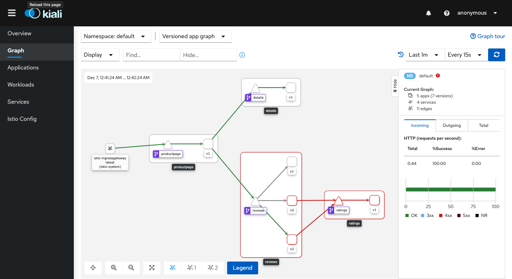
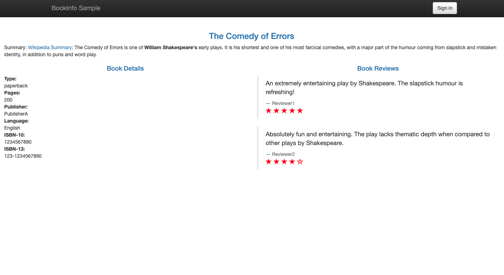
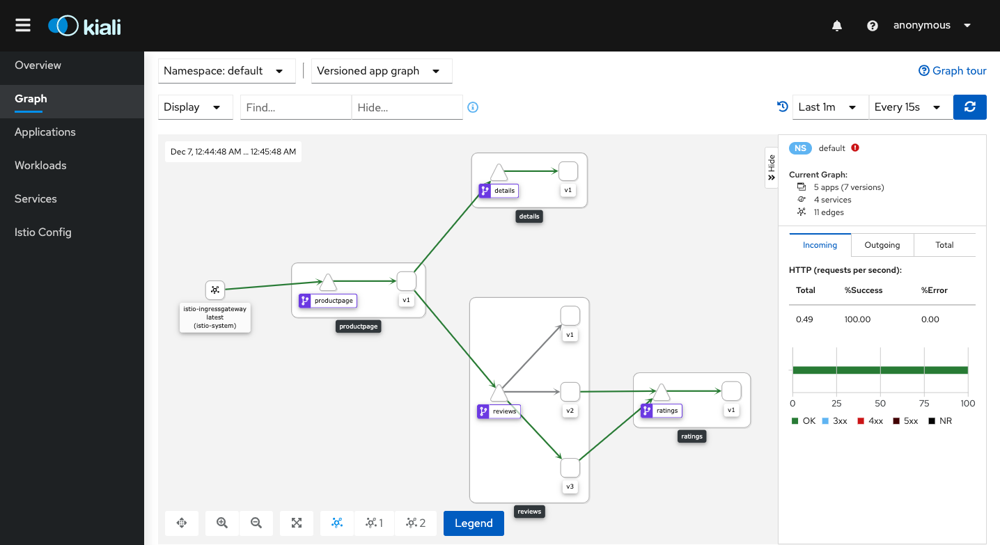

# LAB 12: Setup Istio Authorization

## Description

In this lab we will configure a simple deny-all policy that rejects all requests to the workload, and then we will grant more access to the workload gradually and incrementally.

## Instructions

1. Run the following command to create a deny-all policy in the default namespace.

```
kubectl apply -f - <<EOF
apiVersion: security.istio.io/v1beta1
kind: AuthorizationPolicy
metadata:
  name: deny-all
  namespace: default
spec:
  {}
EOF
```

- Note: The policy doesn’t have a selector field, which applies the policy to every workload in the default namespace

- The spec: field of the policy has the empty value {}, that means that no traffic is permitted, effectively denying all requests.

---

2. To test it, point your browser at the Bookinfo productpage

```
http://<ingress-gateway-external-ip>/productpage
```

<kbd></kbd>

- Note: You should see "RBAC: access denied". The error shows that the configured deny-all policy is working as intended, and Istio doesn’t have any rules that allow any access to workloads in the mesh.

- Note: to get the gateway-external-ip you can use the following command "kubectl get service istio-ingressgateway -n istio-system"

---

3. Let's see what happen in the dashboard, access it from the following url

```
http://<kiali-external-ip>:20001/kiali
```

<kbd></kbd>

- Note: to retrieve the kiali-external-ip you can use the following command "kubectl get svc kiali -n istio-system"

---

4. Run the following command to create a productpage-viewer policy to allow access with GET method to the productpage workload 

```
kubectl apply -f - <<EOF
apiVersion: "security.istio.io/v1beta1"
kind: "AuthorizationPolicy"
metadata:
  name: "productpage-viewer"
  namespace: default
spec:
  selector:
    matchLabels:
      app: productpage
  rules:
  - to:
    - operation:
        methods: ["GET"]
EOF
```

- Note: The policy does not set the from field in the rules which means all sources are allowed, effectively allowing all users and workloads

---

5. To test it, browse to the Bookinfo productpage

```
http://<ingress-gateway-external-ip>/productpage
```

<kbd></kbd>

- Note: you should see the “Bookinfo Sample” page. However, you will see errors on the page

- Note: These errors are expected because we have not granted the productpage workload access to the details and reviews workloads. 

---

6. Let's see what happen in the dashboard, access it from the following url

```
http://<kiali-external-ip>:20001/kiali
```

<kbd></kbd>

---

7. Run the following command to create the details-viewer policy to allow the productpage workload, which issues requests using the "cluster.local/ns/default/sa/bookinfo-productpage" service account, to access the details workload through GET methods

```
kubectl apply -f - <<EOF
apiVersion: "security.istio.io/v1beta1"
kind: "AuthorizationPolicy"
metadata:
  name: "details-viewer"
  namespace: default
spec:
  selector:
    matchLabels:
      app: details
  rules:
  - from:
    - source:
        principals: ["cluster.local/ns/default/sa/bookinfo-productpage"]
    to:
    - operation:
        methods: ["GET"]
EOF
```

---

8. To test it, browse to the Bookinfo productpage

```
http://<ingress-gateway-external-ip>/productpage
```

<kbd></kbd>

- Note: this time you will see the book details (due the product page have access to it)

---

9. Let's see what happen in the dashboard, access it from the following url

```
http://<kiali-external-ip>:20001/kiali
```

<kbd></kbd>

---

10. Run the following command to create a policy reviews-viewer to allow the productpage workload, which issues requests using the cluster.local/ns/default/sa/bookinfo-productpage service account, to access the reviews workload through GET methods

```
kubectl apply -f - <<EOF
apiVersion: "security.istio.io/v1beta1"
kind: "AuthorizationPolicy"
metadata:
  name: "reviews-viewer"
  namespace: default
spec:
  selector:
    matchLabels:
      app: reviews
  rules:
  - from:
    - source:
        principals: ["cluster.local/ns/default/sa/bookinfo-productpage"]
    to:
    - operation:
        methods: ["GET"]
EOF
```

---

11. To test it, browse to the Bookinfo productpage

```
http://<ingress-gateway-external-ip>/productpage
```

<kbd></kbd>

- Note: this time you will see the book details and the reviews but reviews will still falling (this is because the reviews workload doesn’t have permission to access the ratings workload)

---

12. Let's see what happen in the dashboard, access it from the following url

```
http://<kiali-external-ip>:20001/kiali
```

<kbd></kbd>

---

13. Run the following command to create the ratings-viewer policy to allow the reviews workload, which issues requests using the cluster.local/ns/default/sa/bookinfo-reviews service account, to access the ratings workload through GET methods

```
kubectl apply -f - <<EOF
apiVersion: "security.istio.io/v1beta1"
kind: "AuthorizationPolicy"
metadata:
  name: "ratings-viewer"
  namespace: default
spec:
  selector:
    matchLabels:
      app: ratings
  rules:
  - from:
    - source:
        principals: ["cluster.local/ns/default/sa/bookinfo-reviews"]
    to:
    - operation:
        methods: ["GET"]
EOF
```

---

14. To test it, browse to the Bookinfo productpage

```
http://<ingress-gateway-external-ip>/productpage
```

<kbd></kbd>

- Note: this time everything should work well

---

15. Let's see what happen in the dashboard, access it from the following url

```
http://<kiali-external-ip>:20001/kiali
```

<kbd></kbd>
